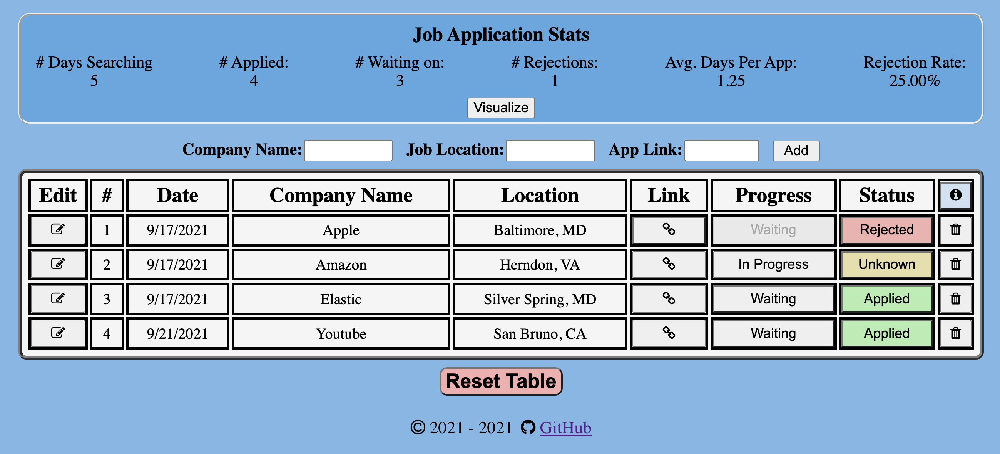

# Job App Tracker w/ Backend

Simple full stack application to help you keep track of your job applications, while you're job hunting. Stores data into MongoDb as you enter, delete or update your applications. 

This is my attempt at redoing my [job app tracker](https://github.com/mwzheng/job-application-tracker), which previously didn't have a backend and stored data into localStorage.

The project is made using the MERN stack (MongoDB, Express.js, React.js, Node.js)

### Functionality:
1. Add a job application to table
2. Open the job application in new tab
3. Check and change your progress or status for a job application
4. Delete a job application from table
5. Check your application Stats
6. Edit a job app's name, location or link
7. Visualize your progress over time with a graph
8. Reset table data

### TODO:
In server directory, rename the sample.env file to .env and add your MongoDb URL

### To Run:
- $ `cd server`
- $ `npm install`
- $ `npm start`
- $ `cd ../client`
- $ `npm install`
- $ `npm start`