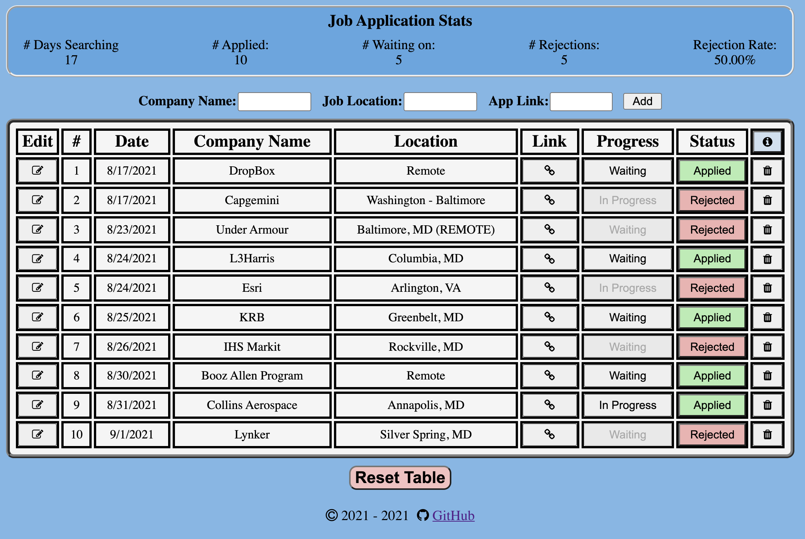

## Job Application Tracker

</br>



A simple react application to help you keep track of all the jobs that you've applied to. Each job includes the date at which you added it, the company name, the job location, a link to the job posting, your application progress (Waiting/In Progress) and the status of the application (Applied/Rejected).

At the top of the page are simple job stats which include the number of days you've been job searching for (Based on your earliest job application), the number of jobs you've applied to, the number of applications you're waiting on, the number of jobs you've been rejected from and the percentage of jobs you've been rejected from.

### Functionality:
1. Add a job application to table
2. Open the job application in new tab
3. Check/Change your progress or status for a job application
4. Delete a job application from table
5. Check your application Stats
6. Edit a job app's name, location or link
7. Reset table data


### Sample Job JSON Format
``` 
{ 
    "number": 1,
    "date": "08/13/21",
    "name": "Some Company Name",
    "location": "City, State",
    "link": "someRandomJobLink.com",
    "progress": "In Progress",
    "status": "Rejected"
} 
```
